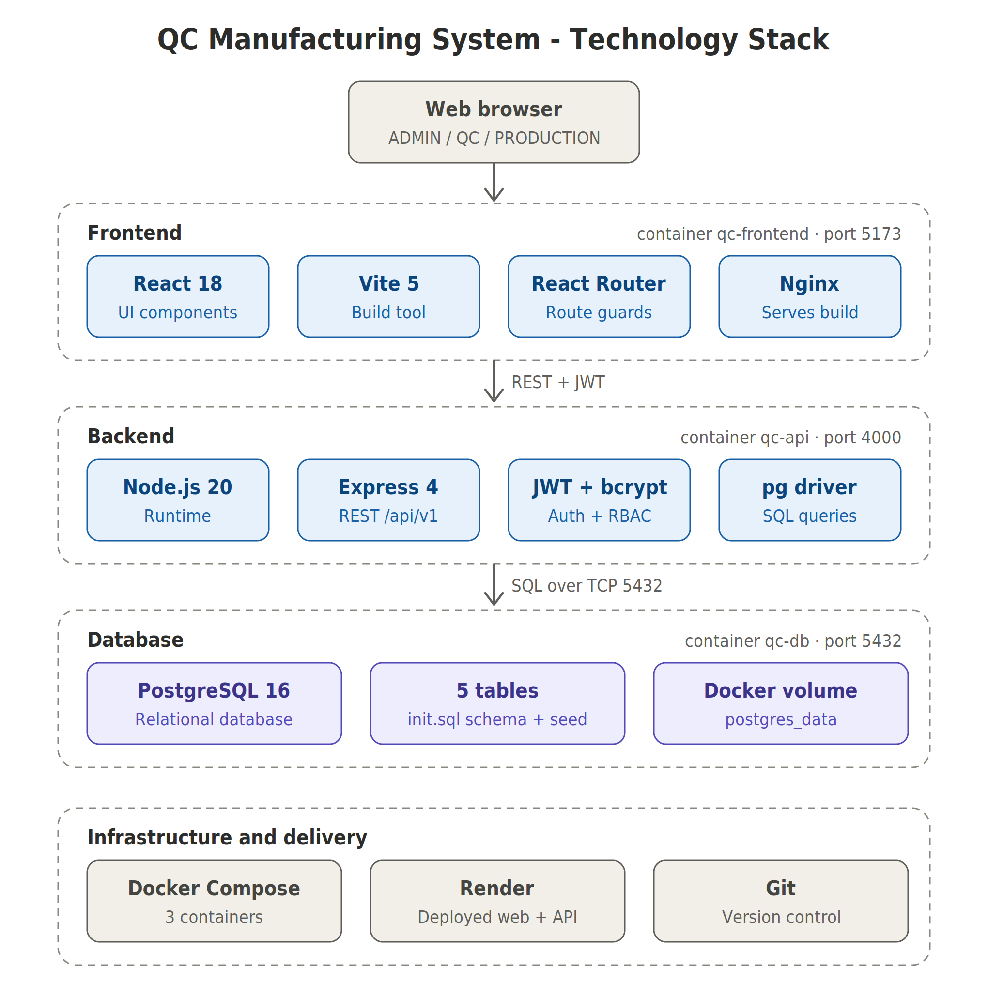
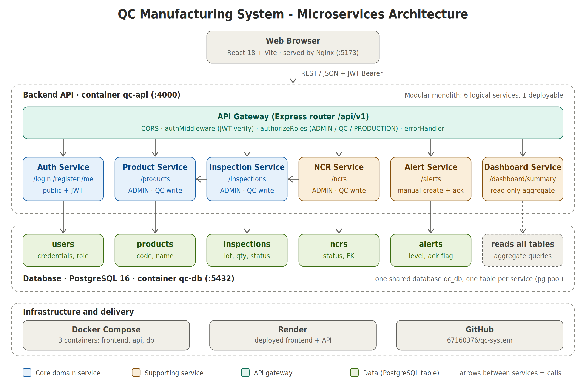

# Architecture — QC Manufacturing System

Repo: https://github.com/67160376/qc-system

## 1. Technology stack diagram

| Tier | Technology |
|---|---|
| Frontend | React 18, Vite 5, React Router 6, served by Nginx (container `qc-frontend`, port 5173) |
| Backend | Node.js 20, Express 4, JWT (`jsonwebtoken`), `bcryptjs`, `pg` (container `qc-api`, port 4000) |
| Database | PostgreSQL 16 (container `qc-db`, port 5432), schema + seed in `database/init.sql` |
| Infrastructure | Docker Compose (3 containers), deployed on Render, source on GitHub |

## 2. Microservices architecture

Six logical services sit behind one API gateway (the Express router with JWT
and role middleware). Each service owns its own table(s) in PostgreSQL.

| Service | Endpoints | Owns table | Calls / depends on |
|---|---|---|---|
| Auth | `/login` `/register` `/me` `/logout` | `users` | - |
| Product | `/products` | `products` | - |
| Inspection | `/inspections` | `inspections` | Product (checks product exists) |
| NCR | `/ncrs` | `ncrs` | Inspection (only when `failed_quantity > 0`, no duplicates) |
| Alert | `/alerts` | `alerts` | - |
| Dashboard | `/dashboard/summary` | (none, read-only) | reads all tables |

**Current deployment status:** the boundaries above are logical
(`routes` → `controllers` → `services` in `api/src`). The six services are
deployed together as one API container and share one database. Splitting them
into separately deployed containers, each with its own database, is future work.

## 3. Status report

Self-assessment: **about 80% complete**.

Done
- Login with JWT + bcrypt, role-based access control (ADMIN / QC / PRODUCTION) on both API and UI routes
- Product CRUD
- Incoming / In-process / Final inspections, inspection history with search and filters
- NCR creation and tracking (validation and 409 on duplicates)
- Alerts (create manually, acknowledge)
- Dashboard using real data from PostgreSQL
- Docker Compose for frontend + API + database, deployed on Render
- README, technology stack diagram, microservices architecture diagram

Not done / known issues
- Alerts are not created automatically when an inspection fails
- No automated tests (only build check and manual role tests)
- `POST /register` is public and accepts a `role` field (needs restriction)
- Frontend `api.js` falls back to the Render API URL, so the local Docker frontend does not call the local API
- Services are not yet split into separate containers/databases
- Dashboard has no charts; no user management page
